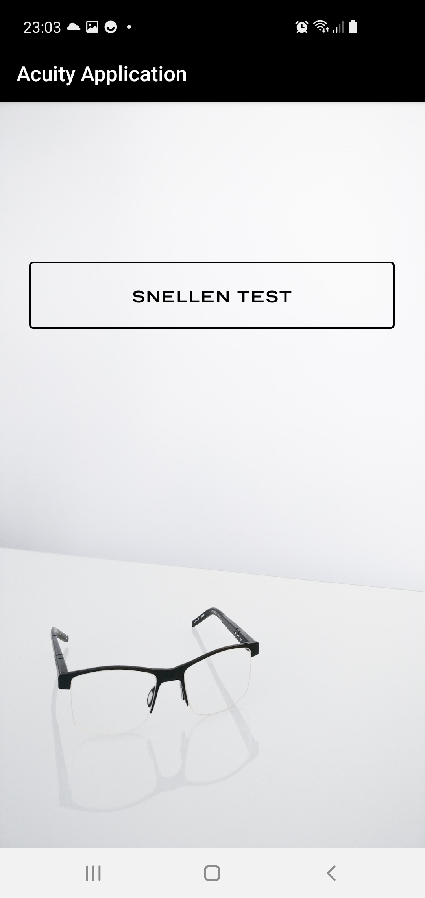
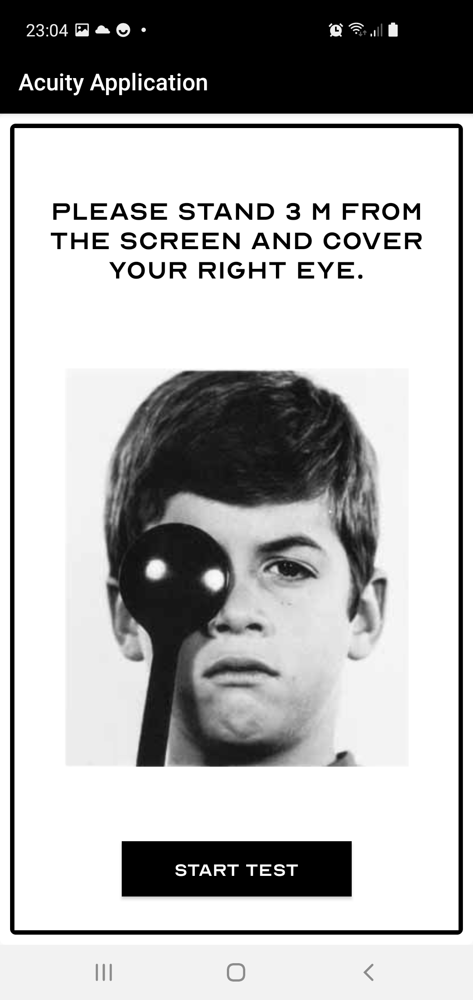
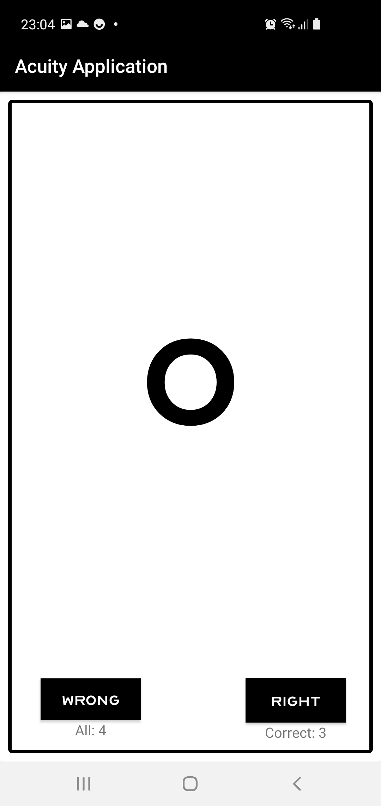
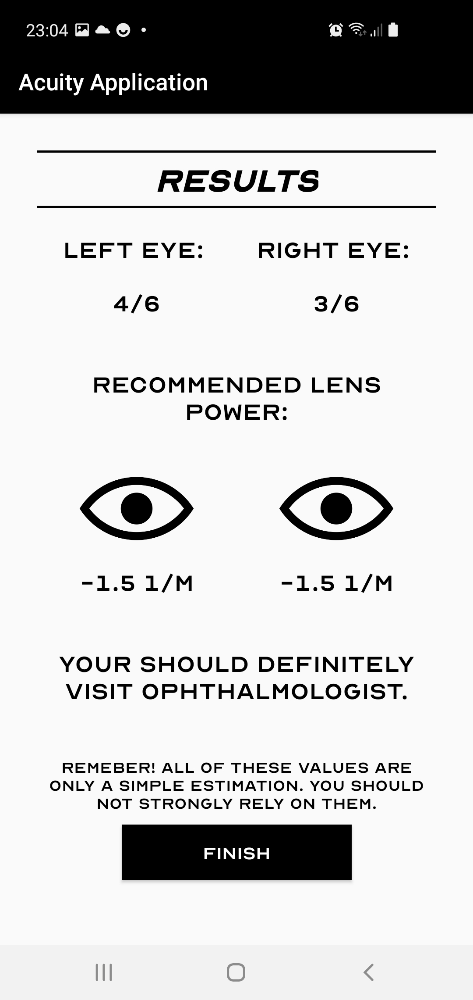

# AcuityTestApp
Mobile application for vision defect detection :mag_right: :eyes:  
Mobile Snellen test which ends with suggestion of probable sight defect in 1/m. 
 
1) Menu:  
  
2) Information screen:  
  
3) Test screen:  
  
4) Result screen:  
  
